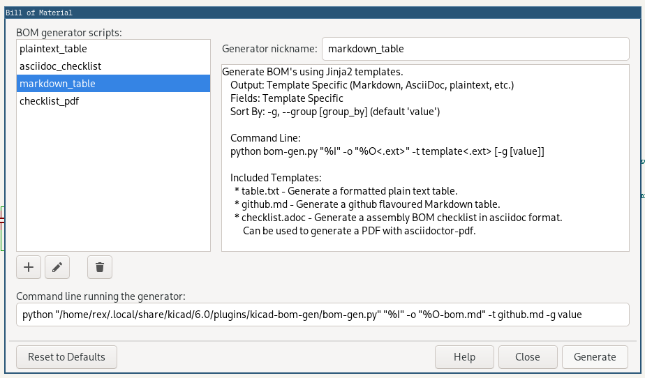

# kicad-bom-gen

A collection of scripts to generate BOMs in various formats from KiCad's
Eeschema (Schematic Editor).



## Components
All BOM generation starts with an input `.xml` file that KiCad generates from
your project’s `.kicad_sch` file. This is referenced as `%I` in the BOM generator
command. The output file, referenced as `%O`, is the full path to the project
including the root of a filename equal to the projects name. An extension +
optional suffix should be added to the filepath in the command. The quotes around
these variables are required in case the filepath contains spaces.\
These paths should get passed to each BOM generation script.

### bom-gen.py
The main and sometimes only step in the generation process is the `bom-gen.py`
python script. This simple script extracts component data from a given input
xml file, and exposes it to a given template for rendering. This allows BOM
templates to be written in the powerful Jinja templating language.

### bom-gen-pdf.py / asciidoctor-pdf
When generating a pdf BOM, the final pdf generation is done using asciidoctor’s
pdf frontend `asciidoctor-pdf`. An intermediate asciidoc format is generated
with `bom-gen.py` first, then the result is rendered to pdf. These two steps are
chained together in the `bom-gen-pdf.py` script.

## Installation
A simple `install.sh` script is provided that copies the scripts to Kicad's
user plugin directory located in `~/.local/share/kicad/<version>/plugins/`.
The corresponding `uninstall.sh` removes them.

### Requirements
- **python**
  - **jinja2**
- **asciidoctor-pdf** _(Required only for generating PDFs from AsciiDoc)_

Python is required to execute the scripts. The package [Jinja2](https://jinja.palletsprojects.com/en/3.1.x/templates/)
is used for templating, it can be installed with `pip install jinja2`. If you
would like to generate PDFs from AsciiDoc, `asciidoctor-pdf` is required to be
installed and included in your $PATH. This can be installed with your distro's
package manager.

## Usage
The scripts should be called from within KiCad from the BOM generator GUI. \
The main script `bom-gen.py` should be passed the input xml `"%I"`, the output
file path with included extension `"%0.ext"`, and a template file. The template
file can be an absolute path to a Jinja template, or it can be the filename of
one of the included templates. Custom templates can be placed in the
`templates/` subdirectory where the script is located. After running the install
script(or placing them directly in the KiCad user plugins directory), they can
be referenced by just the filename.

### Examples
**Generating a Markdown BOM using the included Github Markdown template** 
([output.md](examples/example-github.md)) \
This will generate a Markdown table containing a row for every component, with
the fields: "ref", "value", "MPN" if defined else "footprint".
```sh
python bom-gen.py "%I" -o "%O-bom.md" -t github.md
```

**Generating a plain text table using the included template** 
([output.txt](examples/example-table.txt)) \
This will generate a plain text table that is formatted with an 80 character
length. Contains the fields: "ref", "value", "MPN" if defined else "footprint".
Groups components by value, with one row per group.
```sh
python bom-gen.py "%I" -o "%O-bom.txt" -t table.txt -g
```

**Generating an assembly checklist PDF with asciidoctor-pdf** 
([intermediate.adoc](examples/example-checklist.adoc))
([output.pdf](examples/example-checklist.pdf)) \
This will generate a pdf that contains a table row for every component. Contains
the columns "P" (Placed), "S" (Sourced), "ref", "value", "MPN" if defined else
"footprint", "UPN" (Custom PN).
```sh
python bom-gen-pdf.py "%I" "%O-bom.adoc"
```

---

## Reference

1. **bom-gen.py**\
    `usage: bom-gen.py [-h] [-o OUTFILE] [-t TEMPLATE] [-g [GROUP]] [--no-clean] infile`
    - **positional arguments:**
        - `infile` - Path to KiCad netlist xml file to parse.
    - **options:**
        - `-o, --output OUTFILE` - Path to output rendered BOM. Includes extension.
        - `-t, --template TEMPLATE` - Path to template file, or name of installed template.
        - `-g, --group [GROUP]` - Group components in rows by [group] (default 'value').
        - `--no-clean` - Do not delete input xml file
        - `-h, --help` - Show a help message and exit.
2. **bom-gen-pdf.py**\
    `usage: bom-gen.py infile outfile`
    - **positional arguments:**
        - `infile` - Path to KiCad netlist xml file to parse.
        - `outfile` - Path to output rendered BOM. Includes extension.
